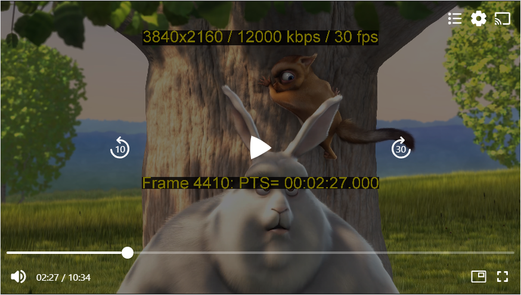

# Getting started with the React Native THEOplayer UI

The [`@theoplayer/react-native-ui`](https://www.npmjs.com/package/@theoplayer/react-native-ui) package provides
a collection of UI components for [`react-native-theoplayer`](https://www.npmjs.com/package/react-native-theoplayer),
the official THEOplayer React Native video player.
The following platforms are supported:

- Android, Android TV & FireTV
- iOS & tvOS (Apple TV)
- Web

This guide covers how to set up the React Native UI, and how to add a UI to your `THEOplayerView` component.



## Prerequisites

If you have no previous experience in React Native, we encourage you to first explore the
[React Native Documentation](https://reactnative.dev/docs/getting-started),
as it gives you a good start on one of the most popular app development frameworks.

## Installation

Using `npm`, `yarn`, or any other package manager, add `@theoplayer/react-native-ui` to your project's dependencies.

The UI components will depend on a `THEOplayerView` instance provided by `react-native-theoplayer`, so make
sure this package is installed.

The UI components also have a few non-transitive dependencies that are required to be installed manually.

```bash
npm install \
  @theoplayer/react-native-ui \
  react-native-theoplayer \
  react-native-svg \
  @react-native-community/slider
```

The package contains a number of transitive dependencies that contain native iOS and Android platform code
as well. These are not auto-linked if your project does not already have them as a dependency,
so they need to be explicitly defined in the `react-native.config.js` file in project's root:

```typescript title="react-native.config.js"
module.exports = {
  dependencies: {
    'react-native-google-cast': {},
    'react-native-svg': {},
    '@react-native-community/slider': {},
  },
};
```

## Using the THEOplayerDefaultUi

The `THEOplayerDefaultUi` can be used to provide basic playback controls to the viewer.
As the default UI also includes Chromecast & Airplay support, make sure to configure these first as explained in the
[cast documentation](https://github.com/THEOplayer/react-native-theoplayer/blob/develop/doc/cast.md).

```tsx
const App = () => {
  return (
    <THEOplayerDefaultUi
      style={StyleSheet.absoluteFill}
      config={playerConfig}
      onPlayerReady={onPlayerReady}
    />
  );
};
```

The UI can be styled with a `theme: THEOplayerTheme` prop, to give it your own look and feel.

Additional components can be passed as properties to be added to the top/bottom control bars of the UI. These can be
components from the `react-native-theoplayer` package, or they could be your own custom components:

```tsx
const App = () => {
  return (
    <THEOplayerDefaultUi
      style={StyleSheet.absoluteFill}
      config={playerConfig}
      {/* A UI component provided by react-native-theoplayer.*/}
      bottomSlot={<PipButton/>}
      {/* A custom component.*/}
      topSlot={<MyCustomComponent/>}
    />
  );
};
```

## Available components

The API documentation of all available components can be found [here](https://theoplayer.github.io/react-native-theoplayer-ui/api/).
Their source code can be found [here](https://github.com/THEOplayer/react-native-theoplayer-ui/tree/develop/src/ui).

## Creating your own custom UI

All components inside the `THEOplayerDefaultUi` are available through the `react-native-theoplayer` package and can
be used to create your own custom layout. Since `THEOplayerDefaultUi` is our version of a "custom" UI, you could
use this as a starting point for your own custom layout.

This use-case is implemented in the [example app](https://github.com/THEOplayer/react-native-theoplayer/blob/develop/doc/example-app.md)
that is included in the `react-native-theoplayer` repository, which adds a
custom [SourceMenuButton](https://github.com/THEOplayer/react-native-theoplayer/blob/develop/example/src/custom/SourceMenuButton.tsx).

During ad playback the UI probably needs to be different compared to during content. This can include disabling seeking,
showing the ad break duration and when the user can skip to content.

Similarly to content playback, the ad UI can be customized by adding components to their respective
slots: `adTop`, `adCenter` and `adBottom`.

The customized ad UI is only available for web at this moment. Android and iOS will have a play/pause interaction
in the middle of the screen together with the default Google IMA ad layout.

The following example shows a UI layout with only basic playback controls:

```tsx
export default function App() {
  const [player, setPlayer] = useState<THEOplayer | undefined>(undefined);
  const onPlayerReady = (player: THEOplayer) => {
    setPlayer(player);
  };
  return (
    <View style={StyleSheet.absoluteFill}>
      <THEOplayerView config={playerConfig} onPlayerReady={onPlayerReady}>
        {player !== undefined && (
          <UiContainer
            theme={DEFAULT_THEOPLAYER_THEME}
            player={player}
            behind={<CenteredDelayedActivityIndicator size={50} />}
            center={
              <CenteredControlBar
                left={<SkipButton skip={-10}/>}
                middle={<PlayButton/>}
                right={<SkipButton skip={30}/>}
              />
            }
            bottom={
              <>
                <ControlBar>
                  <SeekBar />
                </ControlBar>
                <ControlBar>
                  <MuteButton />
                  <TimeLabel showDuration={true} />
                  <Spacer />
                  <FullscreenButton />
                </ControlBar>
              </>
            }
            adTop={
              <ControlBar>
                <AdClickThroughButton />
              </ControlBar>
            }
            adCenter={<CenteredControlBar middle={<PlayButton />} />}
            adBottom={
              <>
                <ControlBar style={{ justifyContent: 'flex-start' }}>
                  <AdDisplay />
                  <AdCountdown />
                  <Spacer />
                  <AdSkipButton />
                </ControlBar>
                <ControlBar>
                  <MuteButton />
                  <SeekBar />
                </ControlBar>
              </>
            }
          />
        )}
      </THEOplayerView>
    </View>
  );
}
```
